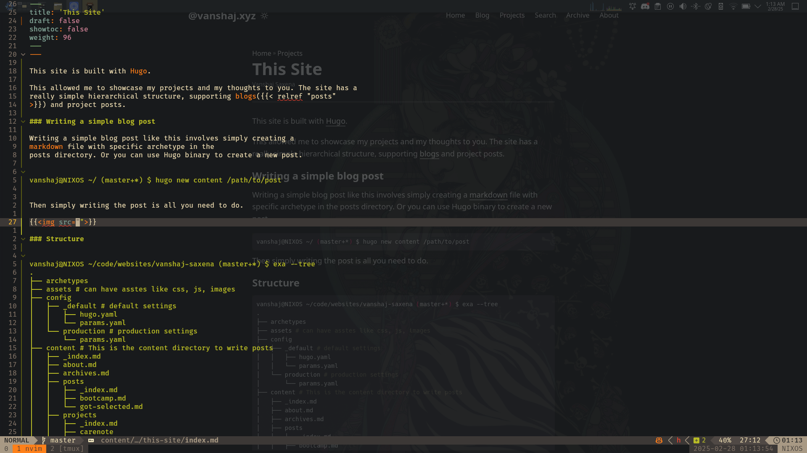

---

This site is built with [Hugo](https://gohugo.io/).

This allowed me to showcase my projects and my thoughts to you. The site has a
really simple hierarchical structure, supporting [blogs]() and project posts.

---

### Writing a simple blog post

Writing a simple blog post like this involves simply creating a
[markdown](https://www.markdownguide.org/) file with specific archetype in the
posts directory. Or you can use Hugo binary to create a new post.

``` shell
vanshaj@NIXOS ~/ (master+*) $ hugo new content /path/to/post
```

Then simply writing the post is all you need to do.


{{}}

---

### Structure

``` shell
vanshaj@NIXOS ~/code/websites/vanshaj-saxena (master+*) $ exa --tree
.
├── archetypes
├── assets # can have asstes like css, js, images
├── config
│   ├── _default # default settings
│   │   ├── hugo.yaml
│   │   └── params.yaml
│   └── production # production settings
│       └── params.yaml
├── content # This is the content directory to write posts
│   ├── _index.md
│   ├── about.md
│   ├── archives.md
│   ├── posts
│   │   ├── _index.md
│   │   ├── bootcamp.md
│   │   └── got-selected.md
│   ├── projects
│   │   ├── _index.md
│   │   ├── carenote
│   │   ├── fable
│   │   ├── neovim
│   │   ├── nix-and-nixos
│   │   └── this-site
│   └── search.md
├── data
├── i18n
├── layouts
│   └── shortcodes
├── public # This is a separate git submodule that provides the frontend for the github pages static site
├── resources
├── static # static diretory for files that are simply copied over to public/
└── themes # themes
```

This project has taught me a number of things about web development tools and
frameworks, although I do not development for the web, I am mostly do [backend
development]() (I am still learning) and I mostly program in Java.

[Source code](https://github.com/VanshajSaxena/vanshaj-saxena-hugo)
